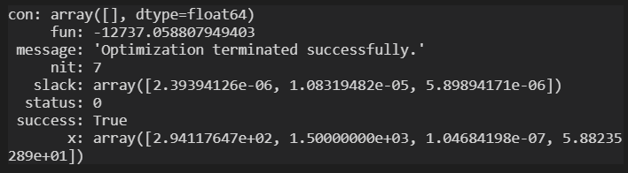
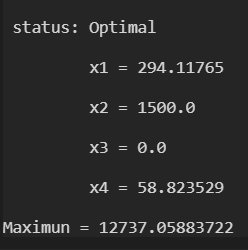
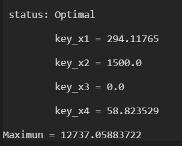

# 用python求解线性规划问题

## 问题的提出

某工厂生产A、B、C、D四种产品，生产这些产品需要甲、乙、丙三种原料，每种产品的相关生产信息如下表所示，请问工厂应该如何安排生产，才能使获得的利润最大？

| 每千克产品所需原材料 |   A   |   B   |   C   |   D   | 原料储量 |
| :------------------: | :---: | :---: | :---: | :---: | :------: |
|        **甲**        |  1.5  |  1.0  |  2.4  |  1.0  |   2000   |
|        **乙**        |  1.0  |  5.0  |  1.0  |  3.5  |   8000   |
|        **丙**        |  1.5  |  3.0  |  3.5  |  1.0  |   5000   |
|  **每千克产品利润**  | 5.24  | 7.30  | 8.34  | 4.18  |

## 模型的建立

这是一个典型的多元线性规划问题，根据规划问题的三要素来建立数学模型。

1. **决策变量**：在这个问题中，每种产品的产量是需要我们进行决策的，设ABCD四种产品的生产计划分别为（单位：千克）
$$
x_{1}、x_{2}、x_{3}、x_{4}
$$
这四个变量就是决策变量。

2. **目标函数**：我们的目的是使利润最大，因此利润的表达式就是我们的目标函数，即

$$
f(x_{1},x_{2},x_{3},x_{4})=5.24*x_{1}+7.30*x_{2}+8.34*x_{3}+4.18*x_{4}
$$

3. **约束条件**：产品的生产要受到原材料的限制，同时产量必须是非负数，由此可以得到约束条件如下：

$$
\begin{Bmatrix}
1.5*x_{1}+1.0*x_{2}+2.4*x_{3}+1.0*x_{4}\le2000
\\1.0*x_{1}+5.0*x_{2}+1.0*x_{3}+3.5*x_{4}\le8000
\\1.5*x_{1}+3.0*x_{2}+3.5*x_{3}+1.0*x_{4}\le5000
\\x_{1},x_{2},x_{3},x_{4}\ge0
\end{Bmatrix}
$$

## 模型的求解

### 法一：利用scipy库求解

首先将模型的三要素导入。

```python
### 【法一】调用scipy库解决线性规划问题
### 电气1807 张从佳 U201811816
from scipy import optimize
import numpy as np

# 目标函数系数
z = np.array([5.24,7.30 ,8.34 ,4.18])

# 约束条件Ax<=b 系数A
a = np.array([[1.5 ,1.0 ,2.4 ,1.0],[1.0 ,5.0 ,1.0 ,3.5],[1.5 ,3.0 ,3.5 ,1.0]])

# 约束条件Ax<=b 系数b
b = np.array([2000 ,8000 ,5000])

# 决策变量取值范围
x1_bound = x2_bound = x3_bound = x4_bound = (0,None)
```

接着求解并输出结果。

```python
# 求解
res = optimize.linprog(-z,A_ub=a,b_ub=b,bounds=(x1_bound,x2_bound,x3_bound,x4_bound))

# 显示结果
print(res)
```

这里需要注意的是，用这种方法求解规划问题时，必须将数学模型转化成scipy库所要求的标准形式，例如将目标函数化为求最小值的问题、将所有的约束条件转化成小于等于的形式等等，否则无法得到正确的结果。程序运行的结果如下图所示：


*法一运行结果*

### 法二：利用pulp库求解

考虑到法一需要对模型进行转化，十分麻烦，我们自然而然地想到有没有一种方法，可以使程序语言和数学语言在形式上非常相近，从而使我们的编程不用绕那么多弯呢？pulp库就能够完美地解决这个问题。

编程的思路和法一相似，同样是先定义三要素，然后求解显示结果，具体的代码可以参见 [preview.py](https://github.com/myOswald/preview_zcj/blob/master/preview.py) ，这里只选择重点部分展示。

```python
# 定义目标函数
prob += 5.24*x1 + 7.30*x2 + 8.34*x3 + 4.18*x4

# 定义约束条件
prob += 1.5*x1 + 1.0*x2 + 2.4*x3 + 1.0*x4 <= 2000
prob += 1.0*x1 + 5.0*x2 + 1.0*x3 + 3.5*x4 <= 8000
prob += 1.5*x1 + 3.0*x2 + 3.5*x3 + 1.0*x4 <= 5000
```

以上是采用pulp库时定义目标函数和约束条件的语句，可见这种定义方法与数学上的书写形式基本上保持一致，很容易理解。程序的运行结果如下图所示：


*法二运行结果*

但是这种方法也有一个小小的缺点，那就是当决策变量的个数很多的时候，这种方法只能一个一个地定义，这样做就很麻烦，法三在此基础上做了改进，克服了这个问题。

### 法三：利用pulp库求解（改进）

为了克服法二中提出的问题，法三利用字典的方法，将所有的系数写入字典中，利用lpSum函数可以对决策变量进行批量操作，大大节省了代码的成本。

下面就是为这个问题编写的一个字典：

```python
# 将相应的系数写入字典
keys = {'x1','x2','x3','x4'}
obj = {'x1':5.24,'x2':7.30,'x3':8.34,'x4':4.18}
constraints1 = {'x1':1.5,'x2':1.0,'x3':2.4,'x4':1.0}
constraints2 = {'x1':1.0,'x2':5.0,'x3':1.0,'x4':3.5}
constraints3 = {'x1':1.5,'x2':3.0,'x3':3.5,'x4':1.0}
```

有了这个字典后，对决策变量的定义、对约束条件的描述就会变得非常简洁：

```python
# 定义决策变量，连续型，范围从0到正无穷
var = LpVariable.dicts('key',keys,0,None,LpContinuous)

# 定义目标函数
prob += lpSum([obj[i]*var[i] for i in keys])

# 定义约束条件
prob += lpSum([constraints1[i]*var[i] for i in keys]) <= constraints_b[0]
prob += lpSum([constraints2[i]*var[i] for i in keys]) <= constraints_b[1]
prob += lpSum([constraints3[i]*var[i] for i in keys]) <= constraints_b[2]
```

这种方法的优点在于，即使决策变量有成百上千个，我们用来定义三要素的语句总是只有寥寥几句代码，极大地节约了代码成本。

同时，我们还可以通过下面的语句将所求解的问题写入一个lp文件中，方便以后进行读取：

```python
# 将问题写进文件
prob.writeLP('problem2.lp')
```

程序运行的结果如下图所示：


*法三运行结果*

## 结论

当各个产品的产量按照下表所示安排时，可以获得最大利润：

| 产品  | 产量（千克） |
| :---: | :----------: |
|   A   |    294.12    |
|   B   |   1500.00    |
|   C   |     0.00     |
|   D   |    58.82     |

最大利润为12737.06元。